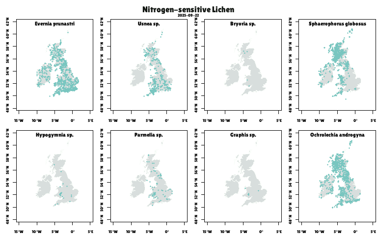

---
output:
  pdf_document: default
  html_document: default
---
Lichen Mapping
================
Rosemary Victoria Greensmith
2025-09-19

This project maps records of various lichen species which are indicators of 
gaseous nitrogen (N2). The records are from the
National Biodiversity Network (NBN) Atlas database, accessed by API
(maximum page size requested was 100).

The subject of this project was inspired by the Field Studies Council WildID 
guide 'Using a lichen based index to nitrogen air quality'. The species growth
forms used are bushy lichen, leafy lichen and crustose or granular lichen.

### Lichen species
This table displays the species of lichen used in this project.

| Nitrogen Sensitive     | Nitrogen Tolerant     |
|:-----------------------|:----------------------|
| Evernia prunastri      | Xanthoria parietina   |
| Usnea sp.              | Xanthoria polycarpa   |
| Bryoria sp.            | Xanthoria ucrainica   |
| Sphaerophorus globosus | Physcia adscendens    |
| Hypogymnia sp.         | Physcia tenella       |
| Parmelia sp.           | Arthonia radiata      |
| Graphis sp.            | Lecidella elaeochroma |
| Ochrolechia androgyna  | Amandinea punctata    |
| \-                     | Candelariella reflexa |

### Indicator species occurrences
These maps show records of each lichen species in the table above.

#### Nitrogen sensitive species

#### Nitrogen tolerant species

### Density of indicator species occurrences
These maps show the interpolated density (kernel density) of nitrogen sensitive 
and nitrogen tolerant species combined.

### Difference between indicator species occurrences
This map shows the difference between the interpolated density of nitrogen sensitive
 and nitrogen tolerant records.

