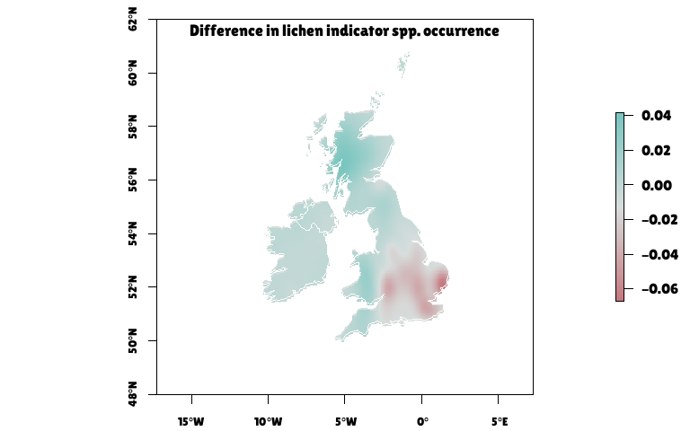

Lichen Mapping
================
Rosemary Victoria Greensmith
2025-09-19

### Lichen species

| nSensitive             | nTolerant             |
|:-----------------------|:----------------------|
| Evernia prunastri      | Xanthoria parietina   |
| Usnea sp.              | Xanthoria polycarpa   |
| Bryoria sp.            | Xanthoria ucrainica   |
| Sphaerophorus globosus | Physcia adscendens    |
| Hypogymnia sp.         | Physcia tenella       |
| Parmelia sp.           | Arthonia radiata      |
| Graphis sp.            | Lecidella elaeochroma |
| Ochrolechia androgyna  | Amandinea punctata    |
| \-                     | Candelariella reflexa |

## Difference between indicator species occurrences

