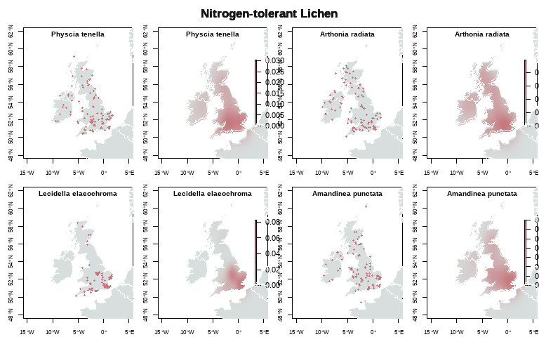
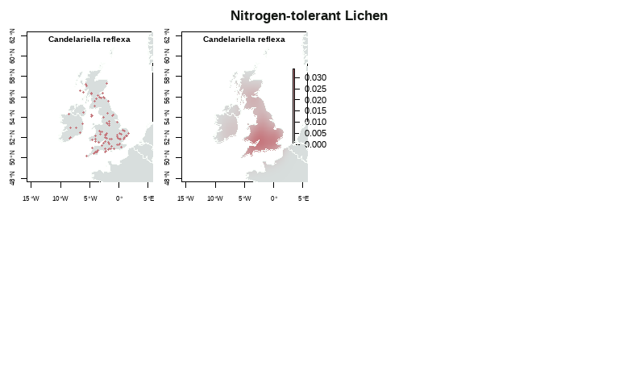
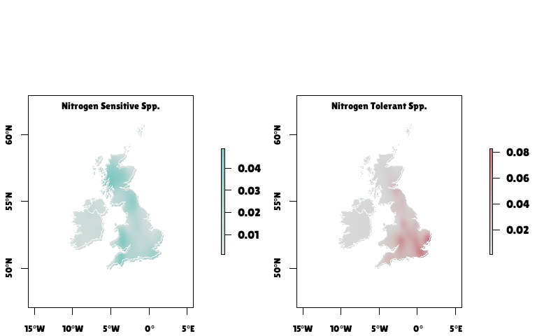

Lichen Mapping
================
Rosemary Victoria Greensmith
2025-09-17

# Functions

## NBN Atlas data function

This code defines a function called getNBNData, for using the NBN Atlas
API key to get the lichen occurrence records.

``` r
###### Get NBN Atlas data ######
# NBN Atlas record filter:
#     - No unconfirmed, unconfirmed (not reviewed) or unconfirmed (plausible)
#     - No absences

getNBNData = function(latinName,numRecords){
  # Split species name into genus and species to parse the API for NBN Atlas
  binomNmSplit = strsplit(latinName,"[ ]")
  genus = binomNmSplit[[1]][1]
  species = binomNmSplit[[1]][2]

  if (species != "sp.") {
    api=paste("https://records-ws.nbnatlas.org/occurrences/search?",
              "q=*:*&fq=genus:",
              genus,
              "&fq=-(identification_verification_status%3A%22Unconfirmed%22%20OR",
              "%20identification_verification_status%3A%22Unconfirmed%20-%20",
              "not%20reviewed%22%20OR%20identification_verification_status%3A%22",
              "Unconfirmed%20-%20plausible%22)&fq=-occurrence_status%3A%22absent",
              "%22&fq=taxon_name%3A%22",
              genus,
              "%20",
              species,
              "%22&pageSize=",numRecords,sep = "")
  } else {
    api=paste("https://records-ws.nbnatlas.org/occurrences/search?",
              "q=*:*&fq=genus:",
              genus,
              "&fq=-(identification_verification_status%3A%22Unconfirmed%22%20OR",
              "%20identification_verification_status%3A%22Unconfirmed%20-%20",
              "not%20reviewed%22%20OR%20identification_verification_status%3A%22",
              "Unconfirmed%20-%20plausible%22)&fq=-occurrence_status%3A%22absent",
              "%22&fq=taxon_name%3A%22",
              genus,
              "%22&pageSize=",numRecords,sep = "")
  }
  taxonInfo = GET(api)
  taxonInfoContent = httr::content(taxonInfo, as = 'text')
  taxonInfoContentJSON = jsonlite::fromJSON(taxonInfoContent)
  df=taxonInfoContentJSON$occurrences
  return(df)
}
```

## NBN mapping function

This function creates a map of occurrence records and has the option to
plot a density map as well.

``` r
occurrenceMap = function(basemap,sppDF,sppName,colGroup = "a",kdePlot = FALSE) {
  # Projection/CRS of base map, NBN Atlas coordinates:
  #     - WGS 84
  plot(st_geometry(basemap),border="#f9fdf9",axes=TRUE,
       xlim=c(-15,5),ylim=c(48.5,61.5),
       col="#d8dedd",cex.axis=0.8)
  
  if(colGroup=="a") {
    pointsCol = "#78C6C0"
  } else {
    pointsCol = "#c6787e"
  }
  points(as.numeric(sppDF$decimalLongitude),
         as.numeric(sppDF$decimalLatitude),
         pch = 19,
         cex = 0.6,
         col=pointsCol)
  
  title(main = sppName,cex.main = 0.9,line = -1)
 
  
  ################ kernel density map #################################
  if (isTRUE(kdePlot)) {
      # Create colour ramp for kernel density estimation of observations
      # using my website colours
    fun_colour_range <- colorRampPalette(c("#d8dedd",pointsCol))   
    my_colours <- fun_colour_range(1000)  
    
    # Setting up the layers to map
    sdf = data.frame(as.numeric(df$decimalLongitude),
                    as.numeric(df$decimalLatitude))
          
    s = SpatialPoints(na.omit(sdf))
    kde.output <- kernelUD(s,h="href", grid = 1000)
    # converts to raster
    kde <- raster(kde.output)
    # sets projection to British National Grid
    projection(kde) <- CRS("+init=EPSG:27700")
    
    masked_kde <- mask(kde, uk_map)
    
    plot(masked_kde,col=my_colours,axes=TRUE,
         xlim=c(-15,5),ylim=c(48.5,61.5))
    plot(st_geometry(uk_map),add = TRUE,border="#f9fdf9")
    title(main = indicatorSpp[a],cex.main = 0.9,line = -1)
  }
}
```

## Lichen Occurrences

### Lichen species names

``` r
# String of species names to loop through
# "Pseudevernia furfuracea" - need to add to nSensitive
nSensitive = c("Evernia prunastri","Usnea sp.",
               "Bryoria sp.","Sphaerophorus globosus","Hypogymnia sp.",
               "Parmelia sp.","Graphis sp.","Ochrolechia androgyna")
# "Punctelia subrudecta" - nTolerant
nTolerant = c("Xanthoria parietina","Xanthoria polycarpa","Xanthoria ucrainica",
              "Physcia adscendens","Physcia tenella",
              "Arthonia radiata","Lecidella elaeochroma","Amandinea punctata",
              "Candelariella reflexa")
```

### Base map

This code displays the raw NBN Atlas data on maps.

``` r
################################################################################
#                 Maps of records from the NBN Atlas
################################################################################


# Set graphical parameters for the maps
op = par(mfrow=c(2,4), font.lab = 2,
         mar=c(2,2.5,1,0.1)+0.1,
         oma=c(0.01,0.01,2,0.01),xpd=FALSE)

###### Get NBN Atlas data and map the records ######
for (z in 1:2) {
  if (z == 1){
    indicatorSpp = nSensitive
  } else {
    indicatorSpp = nTolerant
  }
  for (a in 1:length(indicatorSpp)) {
    df = getNBNData(indicatorSpp[a],100)
    
    if(z==1) {
      colGroup = "a"
      mainTitle = "Nitrogen-sensitive Lichen"
    } else {
      colGroup = "b"
      mainTitle = "Nitrogen-tolerant Lichen"
    }
  
    occurrenceMap(uk_map,df,indicatorSpp[a],colGroup,kdePlot = TRUE)
    
     mtext(mainTitle,
          side = 3, line = -0.14, outer = TRUE,col = c("#131713"),
          font = 2,cex = 1.05)
    rm(df)
  }
  
}
```

<!-- --><!-- --><!-- --><!-- --><!-- -->

## Combined data

``` r
for (z in 1:2) {
  if (z == 1){
    indicatorSpp = nSensitive
    indSppType = "nSensitive"
  } else {
    indicatorSpp = nTolerant
    indSppType = "nTolerant"
  }
  
  numRecords = 1e4

  for (a in 1:length(indicatorSpp)) {
    if (z == 1 && a == 1) {
      df = getNBNData(indicatorSpp[a],numRecords)
      df2 = data.frame(df$scientificName,
                       df$decimalLongitude,
                       df$decimalLatitude,
                       rep(indSppType, times = length(df[,1]))
                     )
    } else {
      df = getNBNData(indicatorSpp[a],numRecords)
      df2 = rbind(df2,data.frame(
        df$scientificName,
        df$decimalLongitude,
        df$decimalLatitude,
        rep(indSppType, times = length(df[,1]))
                     )
                  )
    }
  }
  df2 = na.omit(df2)
}
colnames(df2) = c("scientificName", "decimalLongitude", "decimalLatitude", "indicatorType")

head(df2)
```

    ##      scientificName decimalLongitude decimalLatitude indicatorType
    ## 1 Evernia prunastri        -1.725657        51.95512    nSensitive
    ## 2 Evernia prunastri        -3.671692        55.68707    nSensitive
    ## 3 Evernia prunastri        -6.053338        54.87708    nSensitive
    ## 4 Evernia prunastri        -3.112672        55.88661    nSensitive
    ## 5 Evernia prunastri        -0.207813        51.03806    nSensitive
    ## 6 Evernia prunastri        -4.137410        50.48092    nSensitive

``` r
plot(df2$decimalLongitude,df2$decimalLatitude)
```

<!-- -->

## Combined Map

<!-- --><!-- -->
