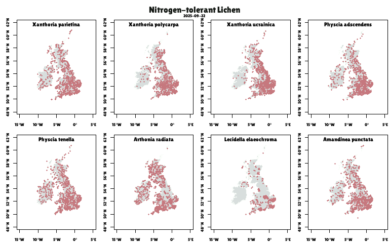
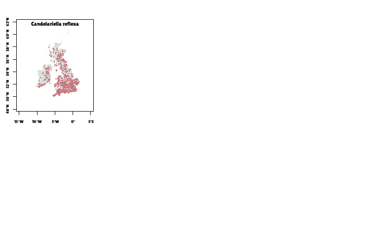

Lichen Mapping
================
Rosemary Victoria Greensmith
2025-09-17

## Lichen Occurrences

### Lichen species names

    ## Warning in cbind(nSensitive, nTolerant): number of rows of result is not a
    ## multiple of vector length (arg 1)

| nSensitive             | nTolerant             |
|:-----------------------|:----------------------|
| Evernia prunastri      | Xanthoria parietina   |
| Usnea sp.              | Xanthoria polycarpa   |
| Bryoria sp.            | Xanthoria ucrainica   |
| Sphaerophorus globosus | Physcia adscendens    |
| Hypogymnia sp.         | Physcia tenella       |
| Parmelia sp.           | Arthonia radiata      |
| Graphis sp.            | Lecidella elaeochroma |
| Ochrolechia androgyna  | Amandinea punctata    |
| \-                     | Candelariella reflexa |

Nitrogen Indicator Species

<!-- ### Base map -->

This code displays the raw NBN Atlas data on maps.

``` r
################################################################################
#                 Maps of records from the NBN Atlas
################################################################################


# Set graphical parameters for the maps
op = par(mfrow=c(2,4), font.lab = 2,
         mar=c(2,2.5,1,0.1)+0.1,
         oma=c(0.01,0.01,2,0.01),xpd=FALSE)

###### Get NBN Atlas data and map the records ######
for (z in 1:2) {
  if (z == 1){
    indicatorSpp = nSensitive
  } else {
    indicatorSpp = nTolerant
  }
  for (a in 1:length(indicatorSpp)) {
    df = getNBNData(indicatorSpp[a],100)
    
    if(z==1) {
      colGroup = "a"
      mainTitle = "Nitrogen-sensitive Lichen"
    } else {
      colGroup = "b"
      mainTitle = "Nitrogen-tolerant Lichen"
    }
  
    occurrenceMap(uk_map,df,indicatorSpp[a],colGroup,kdePlot = TRUE)
    
     mtext(mainTitle,
          side = 3, line = -0.14, outer = TRUE,col = c("#131713"),
          font = 2,cex = 1.05)
    rm(df)
  }
  
}
```

<!-- --><!-- --><!-- --><!-- --><!-- -->

## Combined Species occurrences

    ##      scientificName decimalLongitude decimalLatitude indicatorType
    ## 1 Evernia prunastri        -3.217716        52.02736    nSensitive
    ## 2 Evernia prunastri        -3.309574        51.82857    nSensitive
    ## 3 Evernia prunastri         0.450069        51.13809    nSensitive
    ## 4 Evernia prunastri        -4.075392        56.56116    nSensitive
    ## 5 Evernia prunastri        -4.011536        57.07350    nSensitive
    ## 6 Evernia prunastri        -2.930506        54.57748    nSensitive

<!-- -->

## Combined Map

<!-- --><!-- -->
