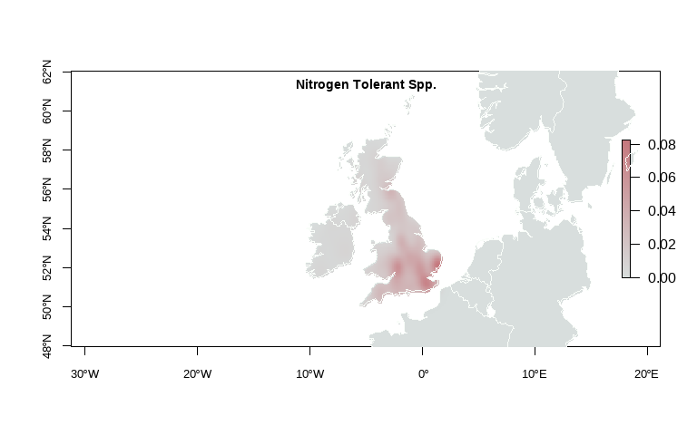

Lichen Mapping
================
Rosemary Victoria Greensmith
2025-09-17

## Lichen Occurrences

### Lichen species names

``` r
# String of species names to loop through
# "Pseudevernia furfuracea" - need to add to nSensitive
nSensitive = c("Evernia prunastri","Usnea sp.",
               "Bryoria sp.","Sphaerophorus globosus","Hypogymnia sp.",
               "Parmelia sp.","Graphis sp.","Ochrolechia androgyna")
# "Punctelia subrudecta" - nTolerant
nTolerant = c("Xanthoria parietina","Xanthoria polycarpa","Xanthoria ucrainica",
              "Physcia adscendens","Physcia tenella",
              "Arthonia radiata","Lecidella elaeochroma","Amandinea punctata",
              "Candelariella reflexa")
```

### Base map

This code displays the raw NBN Atlas data on maps.

``` r
################################################################################
#                 Maps of records from the NBN Atlas
################################################################################


# Set graphical parameters for the maps
op = par(mfrow=c(2,4), font.lab = 2,
         mar=c(2,2.5,1,0.1)+0.1,
         oma=c(0.01,0.01,2,0.01),xpd=FALSE)

###### Get NBN Atlas data and map the records ######
for (z in 1:2) {
  if (z == 1){
    indicatorSpp = nSensitive
  } else {
    indicatorSpp = nTolerant
  }
  for (a in 1:length(indicatorSpp)) {
    df = getNBNData(indicatorSpp[a],100)
    
    if(z==1) {
      colGroup = "a"
      mainTitle = "Nitrogen-sensitive Lichen"
    } else {
      colGroup = "b"
      mainTitle = "Nitrogen-tolerant Lichen"
    }
  
    occurrenceMap(uk_map,df,indicatorSpp[a],colGroup,kdePlot = TRUE)
    
     mtext(mainTitle,
          side = 3, line = -0.14, outer = TRUE,col = c("#131713"),
          font = 2,cex = 1.05)
    rm(df)
  }
  
}
```

<!-- --><!-- --><!-- --><!-- --><!-- -->

## Combined data

``` r
for (z in 1:2) {
  if (z == 1){
    indicatorSpp = nSensitive
    indSppType = "nSensitive"
  } else {
    indicatorSpp = nTolerant
    indSppType = "nTolerant"
  }
  
  numRecords = 1e4

  for (a in 1:length(indicatorSpp)) {
    if (z == 1 && a == 1) {
      df = getNBNData(indicatorSpp[a],numRecords)
      df2 = data.frame(df$scientificName,
                       df$decimalLongitude,
                       df$decimalLatitude,
                       rep(indSppType, times = length(df[,1]))
                     )
    } else {
      df = getNBNData(indicatorSpp[a],numRecords)
      df2 = rbind(df2,data.frame(
        df$scientificName,
        df$decimalLongitude,
        df$decimalLatitude,
        rep(indSppType, times = length(df[,1]))
                     )
                  )
    }
  }
  df2 = na.omit(df2)
}
colnames(df2) = c("scientificName", "decimalLongitude", "decimalLatitude", "indicatorType")

head(df2)
```

    ##      scientificName decimalLongitude decimalLatitude indicatorType
    ## 1 Evernia prunastri        -1.725657        51.95512    nSensitive
    ## 2 Evernia prunastri        -3.671692        55.68707    nSensitive
    ## 3 Evernia prunastri        -6.053338        54.87708    nSensitive
    ## 4 Evernia prunastri        -3.112672        55.88661    nSensitive
    ## 5 Evernia prunastri        -0.207813        51.03806    nSensitive
    ## 6 Evernia prunastri        -4.137410        50.48092    nSensitive

``` r
plot(df2$decimalLongitude,df2$decimalLatitude)
```

<!-- -->

## Combined Map

<!-- --><!-- -->
